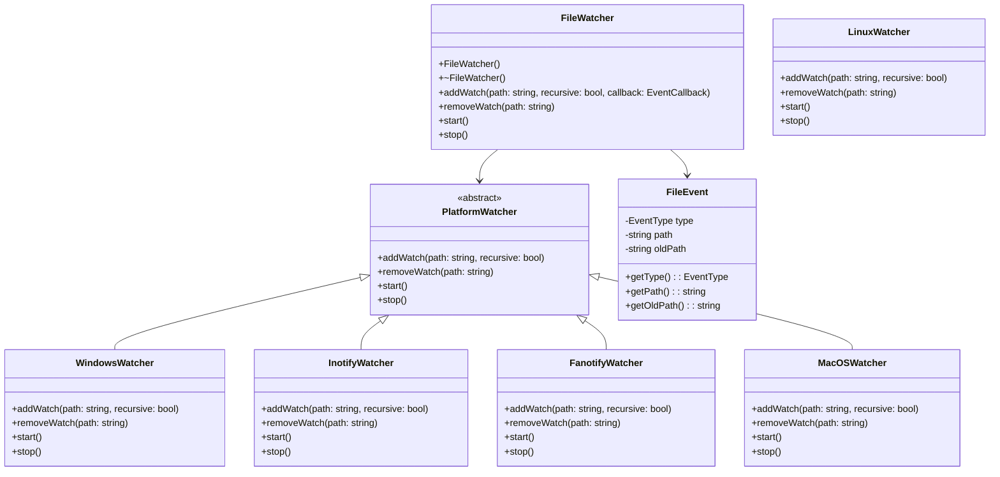

# 文件目录监控库设计文档

## 1. 项目概述

### 1.1 项目目标
实现一个跨平台的 C++ 静态库，用于监控文件和目录的变化，支持实时检测文件的创建、修改、删除等操作，并提供简洁的接口供上层应用使用。

### 1.2 应用场景
- 代码编辑器的文件变化检测
- 构建系统的依赖文件监控
- 配置文件的实时更新检测
- 日志文件的变化监控

## 2. 功能需求

### 2.1 核心功能
- **文件监控**：检测文件的创建、修改、删除、重命名
- **目录监控**：检测目录的创建、删除、重命名
- **递归监控**：支持递归监控子目录
- **事件回调**：通过回调函数通知上层应用文件变化
- **路径类型识别**：区分文件和目录类型
- **过滤功能**：支持按文件类型、路径等过滤监控对象

### 2.2 辅助功能
- **错误处理**：提供详细的错误信息
- **性能优化**：减少系统资源占用
- **跨平台支持**：支持 Windows、Linux、macOS
- **批量事件处理**：合并短时间内的多个事件
- **事件去重**：避免重复处理相同事件
- **监控状态管理**：支持暂停、恢复监控
- **网络中断处理**：在网络恢复后继续监控
- **权限处理**：处理文件权限变化和权限不足的情况
- **日志功能**：记录监控事件和错误信息
- **配置管理**：支持通过配置文件定义监控规则

## 3. 技术选型

### 3.1 底层实现
- **Windows**：使用 ReadDirectoryChangesW API
- **Linux**：
  - **inotify**：用于监控特定目录和文件，支持细粒度事件
  - **fanotify**：用于监控整个文件系统，性能更好，适合大规模监控
- **macOS**：使用 FSEvents API

### 3.2 依赖项
- 标准 C++ 库（C++11 及以上）
- 无第三方依赖，确保库的轻量性

### 3.3 Linux 监控机制对比

#### inotify vs fanotify

| 特性 | inotify | fanotify |
|------|---------|----------|
| **监控范围** | 特定目录和文件 | 整个文件系统 |
| **内核版本** | 2.6.13+ | 2.6.37+ |
| **性能** | 适合中小规模监控 | 适合大规模监控 |
| **权限要求** | 普通用户 | 需要 CAP_SYS_ADMIN 或 root |
| **事件类型** | 细粒度事件 | 较少事件类型 |
| **文件描述符** | 不能获取文件描述符 | 可以获取文件描述符 |
| **拦截能力** | 仅监控 | 可以拦截和决策文件访问 |
| **使用场景** | 应用程序文件监控 | 安全软件、杀毒软件 |

#### 选择策略
- **默认使用 inotify**：适用于大多数应用程序场景，无需特殊权限
- **可选使用 fanotify**：当需要以下特性时启用：
  - 监控整个文件系统
  - 需要拦截文件访问
  - 需要获取文件描述符
  - 大规模文件监控场景

## 4. 架构设计

### 4.1 模块划分

| 模块 | 职责 | 文件 |
|------|------|------|
| 核心监控器 | 跨平台监控实现 | `FileWatcher.h` / `FileWatcher.cpp` |
| 平台适配 | 各平台的具体实现 | `platform/WindowsWatcher.cpp` / `platform/InotifyWatcher.cpp` / `platform/FanotifyWatcher.cpp` / `platform/MacOSWatcher.cpp` |
| 事件处理 | 事件定义和处理 | `Event.h` / `Event.cpp` |
| 工具类 | 通用工具函数 | `utils/PathUtils.h` / `utils/PathUtils.cpp` |

### 4.2 类结构



## 5. 接口定义

### 5.1 核心接口

#### FileWatcher 类

```cpp
class FileWatcher {
public:
    // 事件回调类型
    using EventCallback = std::function<void(const FileEvent&)>;
    
    // 构造函数和析构函数
    FileWatcher();
    ~FileWatcher();
    
    // 添加监控路径
    bool addWatch(const std::string& path, bool recursive, EventCallback callback);
    
    // 监控指定目录下的匹配正则表达式的文件
    bool addWatchWithRegex(const std::string& directory, const std::string& pattern, 
                          bool recursive, EventCallback callback);
    
    // 移除监控路径
    bool removeWatch(const std::string& path);
    
    // 启动监控
    bool start();
    
    // 停止监控
    void stop();
};
```

#### FileEvent 类

```cpp
enum class EventType {
    CREATE,    // 文件/目录创建
    MODIFY,    // 文件修改
    DELETE,    // 文件/目录删除
    RENAME     // 文件/目录重命名
};

enum class PathType {
    FILE,      // 文件
    DIRECTORY  // 目录
};

class FileEvent {
public:
    FileEvent(EventType type, const std::string& path, PathType pathType, 
              const std::string& oldPath = "", PathType oldPathType = PathType::FILE);
    
    EventType getType() const;
    std::string getPath() const;
    PathType getPathType() const;
    std::string getOldPath() const;
    PathType getOldPathType() const;
};
```

## 6. 实现细节

### 6.1 跨平台实现
- **Windows**：使用 ReadDirectoryChangesW API，通过线程监控目录变化
- **Linux**：
  - **inotify**：通过 epoll 或 select 监听事件，支持细粒度监控
  - **fanotify**：监控整个文件系统，支持拦截和决策文件访问
- **macOS**：使用 FSEvents API，注册目录变化回调

### 6.2 性能优化
- **批量处理**：合并短时间内的多个事件
- **防抖处理**：避免频繁的事件触发
- **线程池**：使用线程池处理事件回调，避免阻塞监控线程

### 6.3 错误处理
- 提供详细的错误码和错误信息
- 支持异常和错误回调两种错误处理方式

## 7. 构建系统

### 7.1 CMake 配置

```cmake
cmake_minimum_required(VERSION 3.10)
project(libfilewatch)

set(CMAKE_CXX_STANDARD 11)
set(CMAKE_CXX_STANDARD_REQUIRED ON)

# 源文件
set(SOURCES
    src/FileWatcher.cpp
    src/Event.cpp
    src/utils/PathUtils.cpp
)

# 平台特定源文件
if(WIN32)
    list(APPEND SOURCES src/platform/WindowsWatcher.cpp)
elif(UNIX AND NOT APPLE)
    list(APPEND SOURCES src/platform/LinuxWatcher.cpp)
elif(APPLE)
    list(APPEND SOURCES src/platform/MacOSWatcher.cpp)
endif()

# 头文件
include_directories(include)

# 构建静态库
add_library(filewatch STATIC ${SOURCES})

# 安装配置
install(TARGETS filewatch DESTINATION lib)
install(DIRECTORY include/ DESTINATION include)
```

## 8. 测试计划

### 8.1 单元测试
- 测试文件创建、修改、删除事件
- 测试目录创建、删除事件
- 测试文件重命名事件
- 测试递归监控功能
- 测试过滤功能

### 8.2 性能测试
- 测试监控大量文件时的性能
- 测试高频文件变化时的处理能力
- 测试内存占用情况

## 9. 兼容性考虑

### 9.1 操作系统兼容性
- Windows 7 及以上
- Linux：
  - inotify：内核 2.6.13 及以上
  - fanotify：内核 2.6.37 及以上
- macOS 10.5 及以上（支持 FSEvents）

### 9.2 编译器兼容性
- GCC 4.8 及以上
- Clang 3.4 及以上
- MSVC 2015 及以上

## 10. 代码规范

### 10.1 命名规范
- 类名：驼峰命名法，首字母大写（如 `FileWatcher`）
- 函数名：驼峰命名法，首字母小写（如 `addWatch`）
- 变量名：驼峰命名法，首字母小写（如 `eventCallback`）
- 常量：全大写，下划线分隔（如 `MAX_EVENTS`）

### 10.2 代码风格
- 缩进：4 个空格
- 大括号：新行开始
- 每行长度：不超过 100 字符
- 注释：使用 Doxygen 风格注释

## 11. 目录结构

```
libfilewatch/
├── include/
│   ├── filewatch/
│   │   ├── FileWatcher.h
│   │   ├── Event.h
│   │   └── utils/
│   │       └── PathUtils.h
├── src/
│   ├── FileWatcher.cpp
│   ├── Event.cpp
│   ├── platform/
│   │   ├── WindowsWatcher.cpp
│   │   ├── InotifyWatcher.cpp
│   │   ├── FanotifyWatcher.cpp
│   │   └── MacOSWatcher.cpp
│   └── utils/
│       └── PathUtils.cpp
├── test/
│   ├── unit_test.cpp
│   └── performance_test.cpp
├── CMakeLists.txt
└── DESIGN.md
```

## 12. 示例代码

### 12.1 基本使用示例

```cpp
#include <filewatch/FileWatcher.h>
#include <iostream>

int main() {
    filewatch::FileWatcher watcher;
    
    // 添加监控路径
    watcher.addWatch("./test_dir", true, [](const filewatch::FileEvent& event) {
        std::string pathType = (event.getPathType() == filewatch::PathType::FILE) ? "File" : "Directory";
        
        switch (event.getType()) {
            case filewatch::EventType::CREATE:
                std::cout << pathType << " created: " << event.getPath() << std::endl;
                break;
            case filewatch::EventType::MODIFY:
                std::cout << pathType << " modified: " << event.getPath() << std::endl;
                break;
            case filewatch::EventType::DELETE:
                std::cout << pathType << " deleted: " << event.getPath() << std::endl;
                break;
            case filewatch::EventType::RENAME:
                std::string oldPathType = (event.getOldPathType() == filewatch::PathType::FILE) ? "File" : "Directory";
                std::cout << oldPathType << " renamed: " << event.getOldPath() << " -> " << event.getPath() << std::endl;
                break;
        }
    });
    
    // 启动监控
    watcher.start();
    
    // 等待用户输入
    std::cout << "Press Enter to stop..." << std::endl;
    std::cin.get();
    
    // 停止监控
    watcher.stop();
    
    return 0;
}
```

### 12.2 云盘同步场景示例

```cpp
#include <filewatch/FileWatcher.h>
#include <iostream>
#include <string>

// 云盘同步类
class CloudSync {
public:
    void syncFile(const std::string& path) {
        std::cout << "Syncing file to cloud: " << path << std::endl;
        // 实现文件上传逻辑
    }
    
    void createDirectory(const std::string& path) {
        std::cout << "Creating directory in cloud: " << path << std::endl;
        // 实现目录创建逻辑
    }
    
    void deleteFile(const std::string& path) {
        std::cout << "Deleting file from cloud: " << path << std::endl;
        // 实现文件删除逻辑
    }
    
    void deleteDirectory(const std::string& path) {
        std::cout << "Deleting directory from cloud: " << path << std::endl;
        // 实现目录删除逻辑
    }
    
    void renameFile(const std::string& oldPath, const std::string& newPath) {
        std::cout << "Renaming file in cloud: " << oldPath << " -> " << newPath << std::endl;
        // 实现文件重命名逻辑
    }
    
    void renameDirectory(const std::string& oldPath, const std::string& newPath) {
        std::cout << "Renaming directory in cloud: " << oldPath << " -> " << newPath << std::endl;
        // 实现目录重命名逻辑
    }
};

int main() {
    filewatch::FileWatcher watcher;
    CloudSync cloudSync;
    
    // 添加监控路径（同步目录）
    watcher.addWatch("./sync_dir", true, [&cloudSync](const filewatch::FileEvent& event) {
        switch (event.getType()) {
            case filewatch::EventType::CREATE:
                if (event.getPathType() == filewatch::PathType::FILE) {
                    cloudSync.syncFile(event.getPath());
                } else {
                    cloudSync.createDirectory(event.getPath());
                }
                break;
                
            case filewatch::EventType::MODIFY:
                if (event.getPathType() == filewatch::PathType::FILE) {
                    cloudSync.syncFile(event.getPath());
                }
                break;
                
            case filewatch::EventType::DELETE:
                if (event.getPathType() == filewatch::PathType::FILE) {
                    cloudSync.deleteFile(event.getPath());
                } else {
                    cloudSync.deleteDirectory(event.getPath());
                }
                break;
                
            case filewatch::EventType::RENAME:
                if (event.getPathType() == filewatch::PathType::FILE) {
                    cloudSync.renameFile(event.getOldPath(), event.getPath());
                } else {
                    cloudSync.renameDirectory(event.getOldPath(), event.getPath());
                }
                break;
        }
    });
    
    // 启动监控
    if (watcher.start()) {
        std::cout << "Cloud sync watcher started!" << std::endl;
        std::cout << "Press Enter to stop..." << std::endl;
        std::cin.get();
    } else {
        std::cout << "Failed to start cloud sync watcher!" << std::endl;
    }
    
    // 停止监控
    watcher.stop();
    
    return 0;
}
```

### 12.3 正则表达式监控示例

```cpp
#include <filewatch/FileWatcher.h>
#include <iostream>

int main() {
    filewatch::FileWatcher watcher;
    
    // 监控 images 目录下的图片文件
    watcher.addWatchWithRegex("./images", R"(.*\.(jpg|jpeg|png|gif)$)", true, 
        [](const filewatch::FileEvent& event) {
            std::cout << "Image file event: " << event.getPath() << std::endl;
            // 处理图片文件事件
        }
    );
    
    // 监控 documents 目录下的文档文件
    watcher.addWatchWithRegex("./documents", R"(.*\.(doc|docx|pdf|txt)$)", true, 
        [](const filewatch::FileEvent& event) {
            std::cout << "Document file event: " << event.getPath() << std::endl;
            // 处理文档文件事件
        }
    );
    
    // 启动监控
    if (watcher.start()) {
        std::cout << "Regex watcher started!" << std::endl;
        std::cout << "Press Enter to stop..." << std::endl;
        std::cin.get();
    } else {
        std::cout << "Failed to start regex watcher!" << std::endl;
    }
    
    // 停止监控
    watcher.stop();
    
    return 0;
}
```

## 13. 未来扩展

### 13.1 计划功能
- **网络文件系统监控**：支持监控网络共享目录
- **远程文件监控**：通过网络协议监控远程服务器文件
- **配置文件支持**：通过配置文件定义监控规则
- **日志系统**：内置日志功能，记录监控事件

### 13.2 性能优化
- **事件批处理**：进一步优化事件处理性能
- **内存管理**：减少内存占用
- **并发优化**：提高多线程处理能力

---

## 14. 结论

本设计文档详细描述了文件目录监控库的实现方案，包括核心功能、技术选型、架构设计、接口定义和实现细节。通过跨平台的设计和优化，该库将提供高效、可靠的文件目录监控功能，满足各种应用场景的需求。
## 15. 审查记录

- 代码审查与风险分级见：[CODE_REVIEW_2026-04-06.md](CODE_REVIEW_2026-04-06.md)
